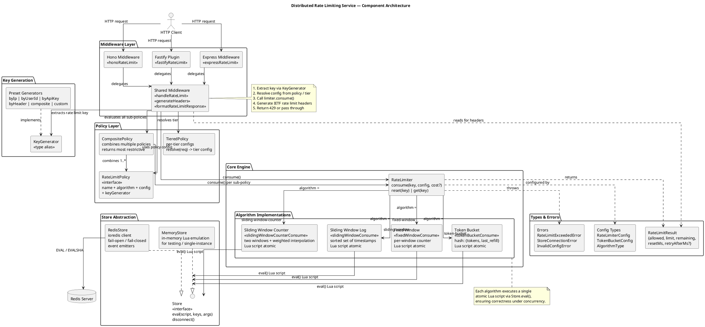

# ratelimit-service

> A distributed rate limiting library for Node.js -- four algorithms, Redis-backed with Lua atomicity, middleware for Express/Fastify/Hono.

[](https://github.com/elliot736/ratelimit-service/actions/workflows/ci.yml)
[](https://typescriptlang.org)
[](LICENSE)

## Why ratelimit-service?

Most rate limiters ship one algorithm and hope for the best. Different use cases need different algorithms -- APIs need burst tolerance (token bucket), quotas need accuracy (sliding window log), simple counters need efficiency (fixed window). ratelimit-service ships four battle-tested algorithms with atomic Redis Lua scripts, pluggable stores, and middleware for the three most popular Node.js frameworks. Pick the right algorithm for your use case, swap stores between Redis and in-memory without changing a line of business logic, and add rate limiting to any route with a single middleware call.

## Features

- **Four algorithms** -- Token bucket, sliding window log, sliding window counter, fixed window
- **Atomic Redis operations** -- Lua scripts prevent race conditions under concurrency
- **Three frameworks** -- Express, Fastify, Hono middleware out of the box
- **IETF-compliant headers** -- `RateLimit-Limit`, `RateLimit-Remaining`, `RateLimit-Reset`
- **Tiered policies** -- Different limits per user tier (free/pro/enterprise)
- **Composite policies** -- Combine limits (10/sec AND 1000/hour)
- **Pluggable stores** -- Redis for distributed, in-memory for single-instance
- **Fail-open/fail-closed** -- Configurable behavior when Redis is unavailable
- **Flexible key generation** -- By IP, user ID, API key, header, or custom function

## Algorithm Comparison

| Algorithm              | Accuracy     | Memory | Burst Handling           | Best For                      |
| ---------------------- | ------------ | ------ | ------------------------ | ----------------------------- |
| Token Bucket           | Good         | O(1)   | Allows controlled bursts | API rate limiting             |
| Sliding Window Log     | Perfect      | O(n)   | No bursts                | Strict quotas                 |
| Sliding Window Counter | Near-perfect | O(1)   | Minimal bursts           | General purpose (recommended) |
| Fixed Window           | Approximate  | O(1)   | 2x burst at boundaries   | Simple counters               |

### Token Bucket

```
Capacity: 5 tokens, Refill: 1 token/sec

t=0s  [*****] 5 tokens  --> Request --> [****-] 4 remaining
t=0s  [****-] 4 tokens  --> Request --> [***--] 3 remaining
t=1s  [****-] 4 tokens  --> (refilled 1) --> Request --> [***--] 3 remaining
t=0s  [***--] 3 tokens  --> Burst x3 --> [-----] 0 remaining
t=0s  [-----] 0 tokens  --> Request --> DENIED (retry after 1s)
t=1s  [*----] 1 token   --> (refilled 1) --> Request --> [-----] 0 remaining
```

The bucket starts full. Each request drains a token. Tokens refill at a steady rate
up to the maximum capacity. Bursts are allowed up to the bucket size, then requests
are throttled to the refill rate.

### Sliding Window Log

```
Window: 5 requests per 10 seconds

Time ----[0s]---[2s]---[4s]---[6s]---[8s]---[10s]---[12s]-->
          |      |      |      |      |       |       |
Reqs:    R1     R2     R3     R4     R5
                                      |
                  |<--- 10s window --->|
                  |  R2  R3  R4  R5   | = 4 requests in window
                                      | R6 allowed (4 < 5)

At t=10s: Window is [0s, 10s]. R1 drops off.
At t=12s: Window is [2s, 12s]. Only R2-R6 in window.

Every request is tracked individually. Perfect accuracy, O(n) memory.
```

### Sliding Window Counter

```
Window: 10 requests per 10 seconds

|------ prev window ------|------ curr window ------|
|   count_prev = 8        |   count_curr = 2        |
|                    [=====|====]                     |
                     ^          ^
                     60% prev   40% curr

Weighted count = 8 * 0.6 + 2 = 6.8
Remaining = floor(10 - 6.8) = 3

Approximates the sliding window using two fixed-window counters with
weighted interpolation. O(1) memory, near-perfect accuracy.
```

### Fixed Window

```
Window: 5 requests per 10 seconds

|--- window 1 (0-10s) ---|--- window 2 (10-20s) ---|
|  R1 R2 R3 R4 R5        |  R1 R2 R3 R4 R5         |
|  counter: 5 (full)      |  counter: 5 (full)       |

THE 2x BURST PROBLEM:
|--- window 1 --------|--- window 2 --------|
                R1..R5 | R1..R5
                  ^        ^
              at t=9.9s  at t=10.0s
              = 10 requests in 0.1 seconds!

Simple and efficient, but allows double the limit at window boundaries.
```

## Quick Start

```bash
npm install ratelimit-service
```

```typescript
import express from "express";
import {
  RateLimiter,
  MemoryStore,
  expressRateLimit,
  byIp,
} from "ratelimit-service";

const app = express();
const store = new MemoryStore();
const limiter = new RateLimiter({ store, algorithm: "sliding-window-counter" });

app.use(
  expressRateLimit({
    limiter,
    policy: {
      name: "api",
      algorithm: "sliding-window-counter",
      config: { limit: 100, windowMs: 60_000 }, // 100 requests per minute
      keyGenerator: byIp,
    },
  }),
);

app.get("/api/data", (req, res) => {
  res.json({ message: "Hello, world!" });
});

app.listen(3000);
```

## Usage

### Express

```typescript
import express from "express";
import {
  RateLimiter,
  RedisStore,
  expressRateLimit,
  byIp,
} from "ratelimit-service";

const app = express();
const store = new RedisStore({ url: "redis://localhost:6379" });
const limiter = new RateLimiter({ store, algorithm: "sliding-window-counter" });

app.use(
  expressRateLimit({
    limiter,
    policy: {
      name: "api",
      algorithm: "sliding-window-counter",
      config: { limit: 100, windowMs: 60_000 },
      keyGenerator: byIp,
    },
    onRateLimited: (key, result) => {
      console.log(`Rate limited: ${key}, retry after ${result.retryAfterMs}ms`);
    },
  }),
);
```

### Fastify

```typescript
import Fastify from "fastify";
import {
  RateLimiter,
  RedisStore,
  fastifyRateLimit,
  byIp,
} from "ratelimit-service";

const app = Fastify();
const store = new RedisStore({ url: "redis://localhost:6379" });
const limiter = new RateLimiter({ store, algorithm: "token-bucket" });

app.register(
  fastifyRateLimit({
    limiter,
    policy: {
      name: "api",
      algorithm: "token-bucket",
      config: { capacity: 20, refillRate: 5 }, // 20 burst, 5/sec sustained
      keyGenerator: byIp,
    },
  }),
);
```

### Hono

```typescript
import { Hono } from "hono";
import {
  RateLimiter,
  RedisStore,
  honoRateLimit,
  byIp,
} from "ratelimit-service";

const app = new Hono();
const store = new RedisStore({ url: "redis://localhost:6379" });
const limiter = new RateLimiter({ store, algorithm: "fixed-window" });

app.use(
  "*",
  honoRateLimit({
    limiter,
    policy: {
      name: "api",
      algorithm: "fixed-window",
      config: { limit: 60, windowMs: 60_000 },
      keyGenerator: byIp,
    },
  }),
);
```

### Tiered Rate Limiting

Apply different limits based on user tier (free, pro, enterprise). The tier is resolved per-request via a custom function -- typically from JWT claims or database lookup.

```typescript
import {
  TieredPolicy,
  RateLimiter,
  RedisStore,
  expressRateLimit,
  byUserId,
} from "ratelimit-service";

const tieredPolicy = new TieredPolicy(
  {
    free: { limit: 100, windowMs: 3_600_000 }, // 100/hour
    pro: { limit: 1_000, windowMs: 3_600_000 }, // 1,000/hour
    enterprise: { limit: 10_000, windowMs: 3_600_000 }, // 10,000/hour
  },
  {
    algorithm: "sliding-window-counter",
    tierResolver: (req) => {
      // Resolve tier from JWT claims, database, or request property
      const user = req["user"] as { tier?: string } | undefined;
      return user?.tier ?? "free";
    },
    defaultTier: "free",
  },
);

app.use(
  expressRateLimit({
    limiter,
    tieredPolicy,
    keyGenerator: byUserId,
  }),
);
```

### Composite Policies

Enforce multiple limits simultaneously -- all must pass. This is how you combine burst protection with sustained rate limits.

```typescript
import { CompositePolicy, byIp } from "ratelimit-service";

const composite = new CompositePolicy([
  {
    name: "per-second",
    algorithm: "fixed-window",
    config: { limit: 10, windowMs: 1_000 }, // 10 req/sec burst limit
    keyGenerator: byIp,
  },
  {
    name: "per-hour",
    algorithm: "sliding-window-counter",
    config: { limit: 1_000, windowMs: 3_600_000 }, // 1,000 req/hour sustained
    keyGenerator: byIp,
  },
]);

app.use(
  expressRateLimit({
    limiter,
    compositePolicy: composite,
  }),
);
```

### Custom Key Generation

```typescript
import {
  custom,
  composite as compositeKey,
  byIp,
  byHeader,
  byApiKey,
} from "ratelimit-service";

// By IP (default)
const ipKey = byIp;

// By API key from a header
const apiKeyGen = byApiKey("Authorization");

// By any header value
const tenantKey = byHeader("X-Tenant-ID");

// Custom logic
const routeKey = custom((req) => `route:${req["path"] ?? "/"}`);

// Combine multiple generators into one key
const compositeKeyGen = compositeKey(byIp, byHeader("X-Tenant-ID"));
// Produces: "ip:1.2.3.4:header:X-Tenant-ID:acme"
```

### Redis Configuration

```typescript
import { RedisStore } from "ratelimit-service";

// Basic connection
const store = new RedisStore({ url: "redis://localhost:6379" });

// Full options
const store = new RedisStore({
  host: "redis.example.com",
  port: 6380,
  password: "secret",
  db: 2,
  keyPrefix: "myapp",
  failMode: "open", // 'open' (default) or 'closed'
});

// Bring your own ioredis client
import Redis from "ioredis";
const client = new Redis("redis://localhost:6379");
const store = new RedisStore({ client, failMode: "closed" });

// Monitor Redis health
store.on("error", (err) => {
  console.error("Redis error:", err);
  alertOps("Rate limiter Redis connection failed");
});

store.on("reconnect", () => {
  console.log("Redis reconnecting...");
});
```

### In-Memory Store (Testing)

The `MemoryStore` implements all algorithms in TypeScript without requiring Redis. Use it for unit tests and single-instance development.

```typescript
import { MemoryStore, RateLimiter } from "ratelimit-service";

const store = new MemoryStore();
const limiter = new RateLimiter({ store, algorithm: "sliding-window-counter" });

// In tests, inject a custom time source for deterministic behavior
const store = new MemoryStore({ nowFn: () => mockTime });
```

## How It Works

### Lua Script Atomicity

Rate limiting requires atomic read-modify-write operations. Without atomicity, two concurrent requests can both read the same counter value, both decide they are under the limit, and both increment -- allowing traffic above the configured limit.

**Why not MULTI/EXEC?** Redis transactions cannot read a value and branch on it within the same transaction. All commands are queued and executed without intermediate results.

**Why not GET + SET?** Race condition. Two requests read `count=99` simultaneously, both see `99 < 100`, both SET `count=100`. Limit of 100 is exceeded.

**Solution: Lua scripts via EVAL.** Redis executes Lua scripts atomically -- the event loop processes the entire script without interleaving other client commands. This gives us both atomicity and conditional logic in a single network round trip.

Here is the token bucket Lua script (simplified):

```lua
-- KEYS[1] = rate limit key
-- ARGV[1] = capacity, ARGV[2] = refill_rate, ARGV[3] = now, ARGV[4] = cost

local tokens = redis.call('HGET', key, 'tokens') or capacity
local last_refill = redis.call('HGET', key, 'last_refill') or now

-- Refill tokens based on elapsed time
local elapsed = now - last_refill
tokens = math.min(capacity, tokens + elapsed * refill_rate)

-- Attempt to consume
if tokens >= cost then
  tokens = tokens - cost
  allowed = 1
else
  retry_after = math.ceil((cost - tokens) / refill_rate * 1000)
end

-- Persist state atomically
redis.call('HMSET', key, 'tokens', tokens, 'last_refill', now)
```

The entire check-and-update happens in one atomic operation. No race conditions, no lost updates, no phantom reads.

### IETF Rate Limit Headers

All middleware adapters set headers following the [IETF draft-ietf-httpapi-ratelimit-headers](https://datatracker.ietf.org/doc/draft-ietf-httpapi-ratelimit-headers/) specification:

| Header                  | Description                                               | Example |
| ----------------------- | --------------------------------------------------------- | ------- |
| `X-RateLimit-Limit`     | Maximum requests allowed in the window                    | `100`   |
| `X-RateLimit-Remaining` | Requests remaining in the current window                  | `42`    |
| `X-RateLimit-Reset`     | Seconds until the rate limit resets                       | `58`    |
| `Retry-After`           | Seconds until the next request will be allowed (429 only) | `30`    |

`Retry-After` is only included in 429 responses. Reset and Retry-After values are always ceiling'd to whole seconds.

## API Reference

### Core

#### `RateLimiter`

```typescript
class RateLimiter {
  constructor(options: {
    store: Store;
    algorithm: AlgorithmType;
    keyPrefix?: string; // default: 'rl'
    nowFn?: () => number; // override time source for testing
  });

  consume(
    key: string,
    config: RateLimiterConfig | TokenBucketConfig,
    cost?: number,
  ): Promise<RateLimitResult>;
  reset(key: string): Promise<void>;
  get(key: string): Promise<RateLimitResult | null>;
}
```

#### `RateLimitResult`

```typescript
interface RateLimitResult {
  allowed: boolean;
  limit: number;
  remaining: number;
  resetMs: number;
  retryAfterMs?: number; // only present when denied
}
```

#### `AlgorithmType`

```typescript
type AlgorithmType =
  | "token-bucket"
  | "sliding-window"
  | "sliding-window-counter"
  | "fixed-window";
```

#### Config Types

```typescript
// For token bucket
interface TokenBucketConfig {
  capacity: number; // max tokens (burst size)
  refillRate: number; // tokens per second
}

// For fixed window, sliding window, sliding window counter
interface RateLimiterConfig {
  limit: number; // max requests in window
  windowMs: number; // window duration in milliseconds
}
```

### Stores

#### `MemoryStore`

```typescript
class MemoryStore implements Store {
  constructor(options?: { nowFn?: () => number });
  eval(
    script: string,
    keys: string[],
    args: (string | number)[],
  ): Promise<unknown>;
  disconnect(): Promise<void>;
}
```

#### `RedisStore`

```typescript
class RedisStore implements Store {
  constructor(options: RedisStoreOptions);
  eval(
    script: string,
    keys: string[],
    args: (string | number)[],
  ): Promise<unknown>;
  disconnect(): Promise<void>;
  on(event: "error" | "reconnect", handler: (...args: unknown[]) => void): void;
}

interface RedisStoreOptions {
  url?: string;
  host?: string;
  port?: number;
  password?: string;
  db?: number;
  keyPrefix?: string;
  failMode?: "open" | "closed";
  client?: RedisClient; // bring your own ioredis instance
}
```

### Middleware

#### `expressRateLimit(config: MiddlewareConfig)`

Returns Express middleware `(req, res, next) => void`.

#### `fastifyRateLimit(config: MiddlewareConfig)`

Returns a Fastify plugin (async function) that registers an `onRequest` hook.

#### `honoRateLimit(config: MiddlewareConfig)`

Returns Hono middleware `(c, next) => Promise<Response | void>`.

#### `MiddlewareConfig`

```typescript
interface MiddlewareConfig {
  limiter: RateLimiter;
  keyGenerator?: KeyGenerator; // default: byIp
  policy?: RateLimitPolicy;
  tieredPolicy?: TieredPolicy;
  compositePolicy?: CompositePolicy;
  onRateLimited?: (key: string, result: RateLimitResult) => void;
  skip?: (req: KeyGeneratorRequest) => boolean;
  requestPropertyName?: string; // attach result to request object
}
```

### Policies

#### `RateLimitPolicy`

```typescript
interface RateLimitPolicy {
  name: string;
  algorithm: AlgorithmType;
  config: RateLimiterConfig | TokenBucketConfig;
  keyGenerator: KeyGenerator;
}
```

#### `TieredPolicy`

```typescript
class TieredPolicy {
  constructor(
    tiers: Record<string, RateLimiterConfig>,
    options: {
      algorithm: AlgorithmType;
      tierResolver: (req: KeyGeneratorRequest) => string;
      defaultTier: string;
    },
  );
  resolve(req: KeyGeneratorRequest): {
    config: RateLimiterConfig;
    tierName: string;
  };
  getAlgorithm(): AlgorithmType;
  getTierNames(): string[];
}
```

#### `CompositePolicy`

```typescript
class CompositePolicy {
  constructor(policies: RateLimitPolicy[]);
  consume(
    limiterFactory: (algorithm: string) => RateLimiter,
    req: KeyGeneratorRequest,
  ): Promise<RateLimitResult>;
  getPolicies(): readonly RateLimitPolicy[];
}
```

### Key Generators

```typescript
type KeyGenerator = (req: KeyGeneratorRequest) => string;

const byIp: KeyGenerator; // "ip:203.0.113.50"
const byUserId: KeyGenerator; // "user:u-abc123"
function byApiKey(header?: string): KeyGenerator; // "apikey:sk-live-xyz"
function byHeader(name: string): KeyGenerator; // "header:X-Tenant-ID:acme"
function composite(...generators: KeyGenerator[]): KeyGenerator;
function custom(fn: (req: KeyGeneratorRequest) => string): KeyGenerator;
```

### Errors

```typescript
class RateLimitExceededError extends Error {
  result: RateLimitResult;
}

class StoreConnectionError extends Error {
  cause?: Error;
}

class InvalidConfigError extends Error {}
```

## Design Decisions

Architecture decisions are documented as ADRs in `docs/adr/`:

| ADR                                           | Decision               | Summary                                                                          |
| --------------------------------------------- | ---------------------- | -------------------------------------------------------------------------------- |
| [001](docs/adr/001-redis-lua-atomicity.md)    | Redis Lua Scripts      | Atomic operations via EVAL prevent race conditions. Single round trip per check. |
| [002](docs/adr/002-algorithm-selection.md)    | Four Algorithms        | Each algorithm trades off accuracy, memory, and burst handling differently.      |
| [003](docs/adr/003-middleware-abstraction.md) | Middleware Abstraction | Shared core logic with thin framework-specific adapters (< 50 lines each).       |
| [004](docs/adr/004-key-design.md)             | Key Design             | Predictable `{prefix}:{policy}:{identifier}` format for debuggability.           |
| [005](docs/adr/005-failure-modes.md)          | Failure Modes          | Fail-open by default; configurable fail-closed for security-critical paths.      |

## Performance

Approximate benchmarks (single Redis instance, localhost):

| Operation                        | Memory Store | Redis Store |
| -------------------------------- | ------------ | ----------- |
| Token bucket check               | ~0.01ms      | ~0.3ms      |
| Sliding window log (100 entries) | ~0.02ms      | ~0.5ms      |
| Sliding window counter check     | ~0.01ms      | ~0.3ms      |
| Fixed window check               | ~0.01ms      | ~0.3ms      |

Redis latency is dominated by the network round trip. The Lua scripts themselves execute in microseconds on the Redis server. For production deployments, Redis response times are typically 0.1-1ms depending on network topology.

## Architecture

### Class Diagram

```plantuml
@startuml class-diagram
skinparam classAttributeIconSize 0
skinparam linetype ortho

' ── Core Types ─────────────────────────────────────────────

package "core/types" {
  interface RateLimitResult {
    +allowed: boolean
    +limit: number
    +remaining: number
    +resetMs: number
    +retryAfterMs?: number
  }

  interface RateLimiterConfig {
    +limit: number
    +windowMs: number
  }

  interface TokenBucketConfig {
    +capacity: number
    +refillRate: number
  }

  enum AlgorithmType {
    token-bucket
    sliding-window
    sliding-window-counter
    fixed-window
  }
}

' ── Core Limiter ───────────────────────────────────────────

package "core" {
  class RateLimiter {
    -store: Store
    -algorithm: AlgorithmType
    -keyPrefix: string
    -nowFn: () => number
    +constructor(options: RateLimiterOptions)
    +consume(key: string, config: RateLimiterConfig | TokenBucketConfig, cost?: number): Promise<RateLimitResult>
    +reset(key: string): Promise<void>
    +get(key: string): Promise<RateLimitResult | null>
  }

  class "<<function>> tokenBucketConsume" as tokenBucketConsume {
    (store, key, config, nowMs, cost): Promise<RateLimitResult>
  }

  class "<<function>> fixedWindowConsume" as fixedWindowConsume {
    (store, key, config, nowMs, cost): Promise<RateLimitResult>
  }

  class "<<function>> slidingWindowConsume" as slidingWindowConsume {
    (store, key, config, nowMs, cost): Promise<RateLimitResult>
  }

  class "<<function>> slidingWindowCounterConsume" as slidingWindowCounterConsume {
    (store, key, config, nowMs, cost): Promise<RateLimitResult>
  }
}

RateLimiter --> tokenBucketConsume : delegates
RateLimiter --> fixedWindowConsume : delegates
RateLimiter --> slidingWindowConsume : delegates
RateLimiter --> slidingWindowCounterConsume : delegates
RateLimiter --> AlgorithmType : selects via
RateLimiter ..> RateLimitResult : returns

' ── Store Layer ────────────────────────────────────────────

package "store" {
  interface Store {
    +eval(script: string, keys: string[], args: (string | number)[]): Promise<unknown>
    +disconnect(): Promise<void>
  }

  class RedisStore implements Store {
    -client: RedisClient
    -failMode: "open" | "closed"
    -ownsClient: boolean
    -eventHandlers: Map<string, EventHandler[]>
    +constructor(options: RedisStoreOptions)
    +eval(script, keys, args): Promise<unknown>
    +disconnect(): Promise<void>
    +on(event: "error" | "reconnect", handler): void
    -emit(event, ...args): void
    -{static} requireIoredis(): RedisClient constructor
  }

  class MemoryStore implements Store {
    -data: Map<string, MemoryEntry>
    -hashes: Map<string, Map<string, string>>
    -hashExpiry: Map<string, number>
    -sortedSets: Map<string, Map<string, number>>
    -sortedSetExpiry: Map<string, number>
    -counters: Map<string, {value, expiresAt?}>
    +nowFn: () => number
    +constructor(options?: {nowFn?})
    +eval(script, keys, args): Promise<unknown>
    +disconnect(): Promise<void>
    -cleanExpired(): void
    -evalTokenBucket(key, args): number[]
    -evalSlidingWindow(key, args): number[]
    -evalSlidingWindowCounter(key, args): number[]
    -evalFixedWindow(key, args): number[]
  }

  interface RedisStoreOptions {
    +url?: string
    +host?: string
    +port?: number
    +password?: string
    +db?: number
    +keyPrefix?: string
    +failMode?: "open" | "closed"
    +client?: RedisClient
  }
}

RateLimiter o-- Store : uses
tokenBucketConsume --> Store : eval()
fixedWindowConsume --> Store : eval()
slidingWindowConsume --> Store : eval()
slidingWindowCounterConsume --> Store : eval()
RedisStore ..> RedisStoreOptions : configured by

' ── Key Generators ─────────────────────────────────────────

package "keys" {
  interface KeyGeneratorRequest {
    +ip?: string
    +headers: Record<string, string | string[] | undefined>
    +userId?: string
  }

  class "<<type>> KeyGenerator" as KeyGenerator {
    (req: KeyGeneratorRequest): string
  }

  class "<<preset generators>>" as PresetGenerators {
    +{static} byIp: KeyGenerator
    +{static} byUserId: KeyGenerator
    +{static} byApiKey(headerName?): KeyGenerator
    +{static} byHeader(headerName): KeyGenerator
    +{static} composite(...generators): KeyGenerator
    +{static} custom(fn): KeyGenerator
  }
}

PresetGenerators ..|> KeyGenerator : produces
KeyGenerator --> KeyGeneratorRequest : reads from

' ── Policies ───────────────────────────────────────────────

package "policies" {
  interface RateLimitPolicy {
    +name: string
    +algorithm: AlgorithmType
    +config: RateLimiterConfig | TokenBucketConfig
    +keyGenerator: KeyGenerator
  }

  class TieredPolicy {
    -tiers: Record<string, RateLimiterConfig>
    -algorithm: AlgorithmType
    -tierResolver: (req) => string
    -defaultTier: string
    +constructor(tiers, options: TieredPolicyOptions)
    +resolve(req: KeyGeneratorRequest): TieredResolution
    +getAlgorithm(): AlgorithmType
    +getTierNames(): string[]
  }

  class CompositePolicy {
    -policies: RateLimitPolicy[]
    +constructor(policies: RateLimitPolicy[])
    +consume(limiterFactory, req): Promise<RateLimitResult>
    +getPolicies(): readonly RateLimitPolicy[]
    -mergeResults(results): RateLimitResult
  }

  interface TieredResolution {
    +config: RateLimiterConfig
    +tierName: string
  }
}

RateLimitPolicy --> AlgorithmType
RateLimitPolicy --> KeyGenerator : uses
CompositePolicy o-- "1..*" RateLimitPolicy : combines
CompositePolicy --> RateLimiter : delegates to
TieredPolicy --> AlgorithmType
TieredPolicy ..> TieredResolution : returns

' ── Middleware ─────────────────────────────────────────────

package "middleware" {
  interface MiddlewareConfig {
    +limiter: RateLimiter
    +keyGenerator?: KeyGenerator
    +policy?: RateLimitPolicy
    +tieredPolicy?: TieredPolicy
    +compositePolicy?: CompositePolicy
    +onRateLimited?: (key, result) => void
    +skipFailedRequests?: boolean
    +skipSuccessfulRequests?: boolean
    +skip?: (req) => boolean
    +requestPropertyName?: string
  }

  class "<<function>> expressRateLimit" as expressRateLimit {
    (config: MiddlewareConfig): Express.Middleware
  }

  class "<<function>> fastifyRateLimit" as fastifyRateLimit {
    (config: MiddlewareConfig): FastifyPluginAsync
  }

  class "<<function>> honoRateLimit" as honoRateLimit {
    (config: MiddlewareConfig): MiddlewareHandler
  }

  class "<<shared>>" as SharedMiddleware {
    +{static} generateHeaders(result): Record<string, string>
    +{static} formatRateLimitResponse(result): {status, body, headers}
    +{static} handleRateLimit(config, req): Promise<{result, response, key}>
  }
}

MiddlewareConfig --> RateLimiter
MiddlewareConfig --> RateLimitPolicy
MiddlewareConfig --> TieredPolicy
MiddlewareConfig --> CompositePolicy
expressRateLimit --> MiddlewareConfig : reads
fastifyRateLimit --> MiddlewareConfig : reads
honoRateLimit --> MiddlewareConfig : reads
expressRateLimit --> SharedMiddleware : uses
fastifyRateLimit --> SharedMiddleware : uses
honoRateLimit --> SharedMiddleware : uses

' ── Errors ─────────────────────────────────────────────────

package "errors" {
  class RateLimitExceededError extends Error {
    +result: RateLimitResult
    +constructor(result: RateLimitResult)
  }

  class StoreConnectionError extends Error {
    +cause?: Error
    +constructor(message: string, cause?: Error)
  }

  class InvalidConfigError extends Error {
    +constructor(message: string)
  }
}

class Error

@enduml
```



### Component Diagram



## Contributing

```bash
# Install dependencies
npm install

# Run tests
npm test

# Run tests with coverage
npm run test:coverage

# Lint
npm run lint

# Type check
npm run typecheck

# Build
npm run build
```

## License

MIT

---

Built by [elliot736](https://ksibati.de) -- [GitHub](https://github.com/elliot736)
